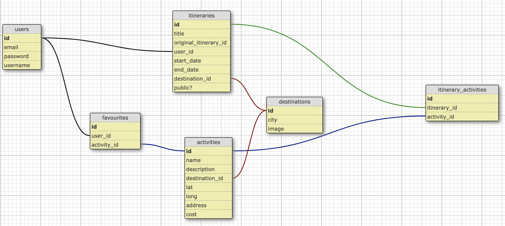

# Tip-a-Trip

<a href="https://www.tip-a-trip.com/" target="_blank">Live website</a> 🌐

<a href="https://www.youtube.com/watch?v=YmIt_ioanJI" target="_blank">Demo video</a> ▶️

---

**Tip-a-Trip** is a platform for keen travellers to create, and get inspired by, customised travel itenaries.

| Problem                                                                | Solution                                                                                                                         |
| :--------------------------------------------------------------------- | :------------------------------------------------------------------------------------------------------------------------------- |
| Planning holiday itineraries is time-consuming                         | A platform with a collection of users' itineraries to take inspiration from                                                      |
| After you go on holiday, your holiday itinerary rarely gets seen again | The platform also allows you to share your past trips with other users (and family/friends) and enables you to relive your trips |

---

### Setup:

Clone the Tip-a-Trip repository from GitHub:
```bash
git clone https://github.com/mikerose151/Tip_a_trip.git
```

And then run this command to seed the database:
```bash
rails db:seed
```

Test login details can be found in `db/seeds/01_users_seeds.rb` or you can sign up yourself

---

### The 2 Main User Stories:

|     User      |                                                                                                              Personality                                                                                                              |                                                Use of Tip-a-Trip                                                 |
| :-----------: | :-----------------------------------------------------------------------------------------------------------------------------------------------------------------------------------------------------------------------------------: | :--------------------------------------------------------------------------------------------------------------: |
| Tripper Trina | 🗺️ Loves going on vacation <br> 🤓 Thinks through everything well in advance <br> 🗂️ Loves to be in control and plan out a bespoke itinerary wherever they go <br> 🗣️ Wants to help other travellers make the most of their vacations | To build itineraries for <br> their vacations using the <br> listed activities, and later <br> share with other users |
|  Lazy Susan   |                            🗺️ Loves going on vacation <br> 🤪 Very last-minute and spontaneous <br> 😵‍💫 Hates planning; finds it daunting and boring <br> 🕵️ Has no shame in copying exactly what others do                            |            To select and use <br> itineraries already curated <br> by fellow users like <br> Tripper Trina            |

---

### Database Schema explained:

<kbd>
  
</kbd>

<ins>Step 1:</ins><br>
Tripper Trina **(USER)** decides to create an itinerary **(ITINERARY)** for their upcoming trip to London **(DESTINATION)**.

<ins>Step 2:</ins><br>
Tip-a-Trip will guide Trina to a list of activities available to do in London, which Trina can favourite or ignore based on if they're interested in doing that activity on their trip. Tripper Trina likes the look of the London Eye **(ACTIVITY)** and Borough Market **(ACTIVITY)** and "favourites" both of those activities **(FAVOURITE x2)**.

<ins>Step 3:</ins><br>
Tip-a-Trip then guides Trina to the itinerary's building page, where the user can see a list of their favourited activities located in the destination of that itinerary (in this case, Trina will see the London activities they favourited) - favourites are essentially a shortlist of activities for their itinerary. Trina will then confirm which of those favourites to actually add to their itinerary. For instance, Trina decides against including the London Eye on their itinerary but does include Borough Market **(ITINERARY ACTIVITY)**.

---

### Demo:

[Video coming soon!]

---

### Ideas for Future Development:

<ins>Technical:</ins>

- Time allocation/calculation
- Map integration
- Private section to upload holiday photos etc. to share with friends/family
- Incentive/gamification to encourage users to make good itineraries

<ins>Business:</ins>

- Partnerships with tourism boards
- Partnerships with tourist attractions

---

### Credits:

- Mike Rose (me)
- Georgia Proctor
- Fara Bashorun
- Nnamdi Dibigbo
- Tommy Down
- Le Wagon coding bootcamp and its teaching staff

---

### Get in touch:

If you have any questions or would like to discuss this work, please contact michaelrose151@gmail.com
